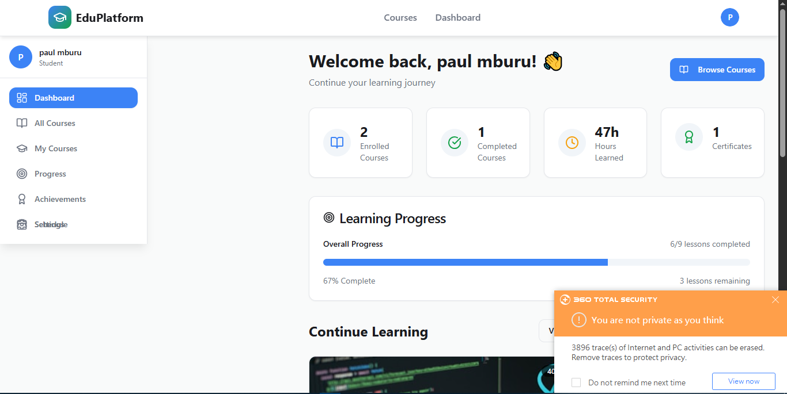
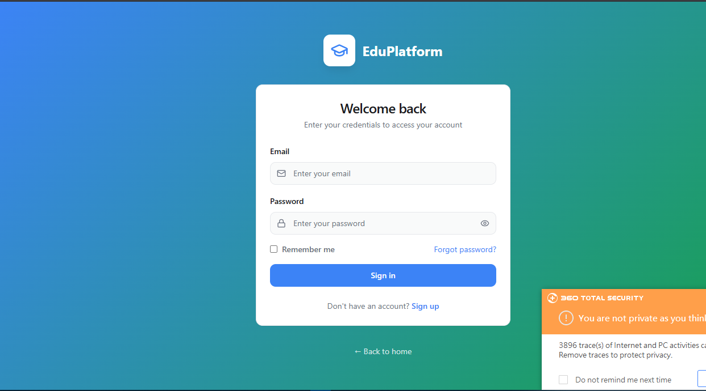

# 📚 MERN LMS – Learning Management System

A full-featured Learning Management System (LMS) built with the **MERN stack** (MongoDB, Express.js, React, Node.js), allowing users to register, enroll in courses, view lessons, and track their learning progress.

🚀 **Live Demo:** [https://lms-7-6up1.onrender.com](https://lms-7-6up1.onrender.com)

---

## 📦 Features

- ✅ User Registration & Login (JWT Authentication)
- 👩‍🏫 Instructor course creation and management
- 🎓 Student enrollment
- 📘 Course and lesson display
- 📊 Progress tracking
- ⚙️ Admin controls (optional extension)
- 📦 RESTful API backend
- 🎨 Responsive frontend UI with Tailwind CSS and ShadCN

---

## 🛠 Tech Stack

- **Frontend:** React, Axios, React Router DOM, Tailwind CSS, ShadCN, Lucide React
- **Backend:** Node.js, Express, MongoDB, Mongoose, bcryptjs, dotenv, jsonwebtoken (JWT), nodemon
- **Deployment:** Render

---

## 🧑‍💻 Local Development Setup

### 1. Clone the repository

```bash
git clone https://github.com/your-username/your-lms-repo.git
cd your-lms-repo
```
### 1. Backend setup

cd server
pnpm install

### .env
PORT=1000
MONGO_URI=your_mongodb_connection_string
JWT_SECRET=your_jwt_secret

##start server pnpm dev

### 3. Frontend Setup
cd client
pnpm install
*create .env file* 
-- VITE_API_BASE_URL=http://localhost:1000/api

*start server*
pnpm dev


### screenshots





